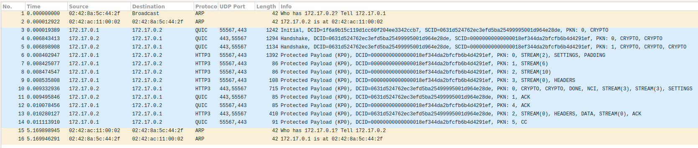
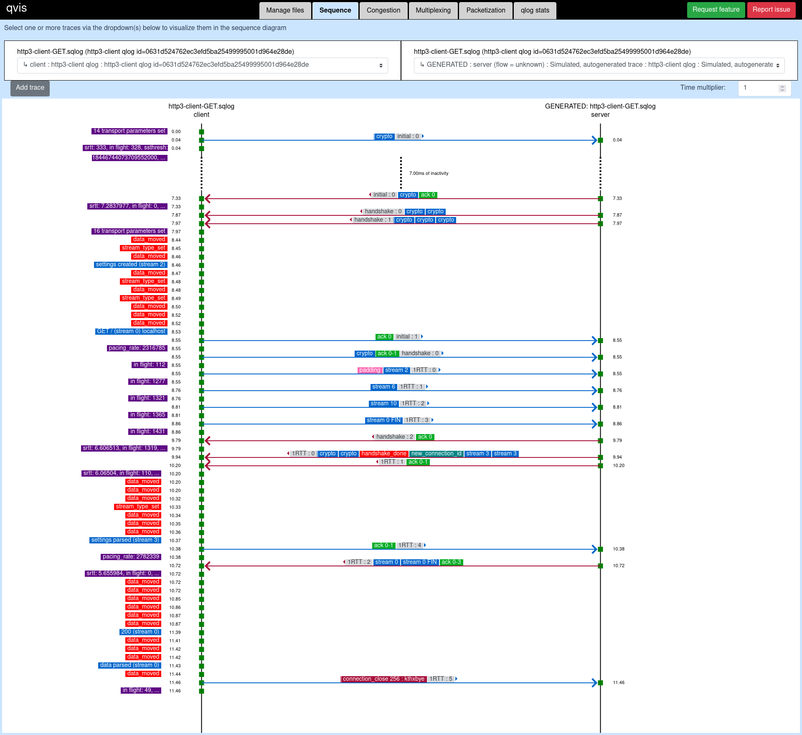

# HTTP/3 Demo

- [HTTP/3 Demo](#http3-demo)
  - [Visualization HTTP3 GET](#visualization-http3-get)
    - [Wireshark](#wireshark)
    - [qvis](#qvis)
    - [Packets in detail](#packets-in-detail)
      - [(1) QUIC / Initial (Client -\> Server)](#1-quic--initial-client---server)
      - [(2) QUIC / Handshake (Server -\> Client)](#2-quic--handshake-server---client)
      - [(3) QUIC / Handshake (Server -\> Client)](#3-quic--handshake-server---client)
      - [(4) HTTP3 / SETTINGS (Client -\> Server)](#4-http3--settings-client---server)
      - [(5) HTTP3 / QPACK Encoder Stream (Client -\> Server)](#5-http3--qpack-encoder-stream-client---server)
      - [(6) HTTP3 / QPACK Decoder Stream (Client -\> Server)](#6-http3--qpack-decoder-stream-client---server)
      - [(7) HTTP3 / HEADERS (Client -\> Server)](#7-http3--headers-client---server)
      - [(8) HTTP3 / (Server -\> Client)](#8-http3--server---client)
      - [(9) QUIC / ACK (Server -\> Client)](#9-quic--ack-server---client)
      - [(10) QUIC / ACK (Client -\> Server)](#10-quic--ack-client---server)
      - [(11) HTTP3 / DATA (Server -\> Client)](#11-http3--data-server---client)
      - [(12) QUIC / CC (Client -\> Server)](#12-quic--cc-client---server)
  - [References](#references)
  - [Licenses](#licenses)
  - [Misc notes](#misc-notes)
    - [Create self-signed certificate](#create-self-signed-certificate)

## Visualization HTTP3 GET

### Wireshark



### qvis



### Packets in detail

#### (1) QUIC / Initial (Client -\> Server)

```
Frame 3: 1242 bytes on wire (9936 bits), 1242 bytes captured (9936 bits) on interface docker0, id 0
Ethernet II, Src: 02:42:8a:5c:44:2f (02:42:8a:5c:44:2f), Dst: 02:42:ac:11:00:02 (02:42:ac:11:00:02)
Internet Protocol Version 4, Src: 172.17.0.1, Dst: 172.17.0.2
User Datagram Protocol, Src Port: 55567, Dst Port: 443
QUIC IETF
    QUIC Connection information
        [Connection Number: 0]
    [Packet Length: 328]
    1... .... = Header Form: Long Header (1)
    .1.. .... = Fixed Bit: True
    ..00 .... = Packet Type: Initial (0)
    .... 00.. = Reserved: 0
    .... ..00 = Packet Number Length: 1 bytes (0)
    Version: 1 (0x00000001)
    Destination Connection ID Length: 16
    Destination Connection ID: 1f6a9b15c119d1cc60f204ee3342ccb7
    Source Connection ID Length: 20
    Source Connection ID: 0631d524762ec3efd5ba25499995001d964e28de
    Token Length: 0
    Length: 282
    Packet Number: 0
    Payload: 71d4687b1442df7dd6a2ad1b6d8f001fa4f479b5ef250969b33dde6c2881d50ed425cbbe…
    CRYPTO
        Frame Type: CRYPTO (0x0000000000000006)
        Offset: 0
        Length: 261
        Crypto Data
        TLSv1.3 Record Layer: Handshake Protocol: Client Hello
            Handshake Protocol: Client Hello
                Handshake Type: Client Hello (1)
                Length: 257
                Version: TLS 1.2 (0x0303)
                Random: bd0514b9a9c8ac53df01b9bba28a7b00e4a258937fe502c9e7a3b11769bfb9f8
                Session ID Length: 0
                Cipher Suites Length: 6
                Cipher Suites (3 suites)
                    Cipher Suite: TLS_AES_128_GCM_SHA256 (0x1301)
                    Cipher Suite: TLS_AES_256_GCM_SHA384 (0x1302)
                    Cipher Suite: TLS_CHACHA20_POLY1305_SHA256 (0x1303)
                Compression Methods Length: 1
                Compression Methods (1 method)
                    Compression Method: null (0)
                Extensions Length: 210
                Extension: server_name (len=14)
                    Type: server_name (0)
                    Length: 14
                    Server Name Indication extension
                        Server Name list length: 12
                        Server Name Type: host_name (0)
                        Server Name length: 9
                        Server Name: localhost
                Extension: supported_groups (len=8)
                    Type: supported_groups (10)
                    Length: 8
                    Supported Groups List Length: 6
                    Supported Groups (3 groups)
                        Supported Group: x25519 (0x001d)
                        Supported Group: secp256r1 (0x0017)
                        Supported Group: secp384r1 (0x0018)
                Extension: application_layer_protocol_negotiation (len=23)
                    Type: application_layer_protocol_negotiation (16)
                    Length: 23
                    ALPN Extension Length: 21
                    ALPN Protocol
                        ALPN string length: 2
                        ALPN Next Protocol: h3
                        ALPN string length: 5
                        ALPN Next Protocol: h3-29
                        ALPN string length: 5
                        ALPN Next Protocol: h3-28
                        ALPN string length: 5
                        ALPN Next Protocol: h3-27
                Extension: signature_algorithms (len=20)
                    Type: signature_algorithms (13)
                    Length: 20
                    Signature Hash Algorithms Length: 18
                    Signature Hash Algorithms (9 algorithms)
                        Signature Algorithm: ecdsa_secp256r1_sha256 (0x0403)
                            Signature Hash Algorithm Hash: SHA256 (4)
                            Signature Hash Algorithm Signature: ECDSA (3)
                        Signature Algorithm: rsa_pss_rsae_sha256 (0x0804)
                            Signature Hash Algorithm Hash: Unknown (8)
                            Signature Hash Algorithm Signature: SM2 (4)
                        Signature Algorithm: rsa_pkcs1_sha256 (0x0401)
                            Signature Hash Algorithm Hash: SHA256 (4)
                            Signature Hash Algorithm Signature: RSA (1)
                        Signature Algorithm: ecdsa_secp384r1_sha384 (0x0503)
                            Signature Hash Algorithm Hash: SHA384 (5)
                            Signature Hash Algorithm Signature: ECDSA (3)
                        Signature Algorithm: rsa_pss_rsae_sha384 (0x0805)
                            Signature Hash Algorithm Hash: Unknown (8)
                            Signature Hash Algorithm Signature: Unknown (5)
                        Signature Algorithm: rsa_pkcs1_sha384 (0x0501)
                            Signature Hash Algorithm Hash: SHA384 (5)
                            Signature Hash Algorithm Signature: RSA (1)
                        Signature Algorithm: rsa_pss_rsae_sha512 (0x0806)
                            Signature Hash Algorithm Hash: Unknown (8)
                            Signature Hash Algorithm Signature: Unknown (6)
                        Signature Algorithm: rsa_pkcs1_sha512 (0x0601)
                            Signature Hash Algorithm Hash: SHA512 (6)
                            Signature Hash Algorithm Signature: RSA (1)
                        Signature Algorithm: rsa_pkcs1_sha1 (0x0201)
                            Signature Hash Algorithm Hash: SHA1 (2)
                            Signature Hash Algorithm Signature: RSA (1)
                Extension: key_share (len=38)
                    Type: key_share (51)
                    Length: 38
                    Key Share extension
                        Client Key Share Length: 36
                        Key Share Entry: Group: x25519, Key Exchange length: 32
                            Group: x25519 (29)
                            Key Exchange Length: 32
                            Key Exchange: 037e551c2d1249017a60a2c10cf9d3b7e450106010c344c6610a29e05827c738
                Extension: psk_key_exchange_modes (len=2)
                    Type: psk_key_exchange_modes (45)
                    Length: 2
                    PSK Key Exchange Modes Length: 1
                    PSK Key Exchange Mode: PSK with (EC)DHE key establishment (psk_dhe_ke) (1)
                Extension: supported_versions (len=3)
                    Type: supported_versions (43)
                    Length: 3
                    Supported Versions length: 2
                    Supported Version: TLS 1.3 (0x0304)
                Extension: quic_transport_parameters (len=70)
                    Type: quic_transport_parameters (57)
                    Length: 70
                    Parameter: max_idle_timeout (len=2) 5000 ms
                        Type: max_idle_timeout (0x01)
                        Length: 2
                        Value: 5388
                        max_idle_timeout: 5000
                    Parameter: max_udp_payload_size (len=2) 1350
                        Type: max_udp_payload_size (0x03)
                        Length: 2
                        Value: 4546
                        max_udp_payload_size: 1350
                    Parameter: initial_max_data (len=4) 10000000
                        Type: initial_max_data (0x04)
                        Length: 4
                        Value: 80989680
                        initial_max_data: 10000000
                    Parameter: initial_max_stream_data_bidi_local (len=4) 1000000
                        Type: initial_max_stream_data_bidi_local (0x05)
                        Length: 4
                        Value: 800f4240
                        initial_max_stream_data_bidi_local: 1000000
                    Parameter: initial_max_stream_data_bidi_remote (len=4) 1000000
                        Type: initial_max_stream_data_bidi_remote (0x06)
                        Length: 4
                        Value: 800f4240
                        initial_max_stream_data_bidi_remote: 1000000
                    Parameter: initial_max_stream_data_uni (len=4) 1000000
                        Type: initial_max_stream_data_uni (0x07)
                        Length: 4
                        Value: 800f4240
                        initial_max_stream_data_uni: 1000000
                    Parameter: initial_max_streams_bidi (len=2) 100
                        Type: initial_max_streams_bidi (0x08)
                        Length: 2
                        Value: 4064
                        initial_max_streams_bidi: 100
                    Parameter: initial_max_streams_uni (len=2) 100
                        Type: initial_max_streams_uni (0x09)
                        Length: 2
                        Value: 4064
                        initial_max_streams_uni: 100
                    Parameter: ack_delay_exponent (len=1)
                        Type: ack_delay_exponent (0x0a)
                        Length: 1
                        Value: 03
                        ack_delay_exponent: 3
                    Parameter: GREASE (len=1) 25
                        Type: GREASE (0x0b)
                        Length: 1
                        Value: 19
                        max_ack_delay: 25
                    Parameter: disable_active_migration (len=0)
                        Type: disable_active_migration (0x0c)
                        Length: 0
                        Value: <MISSING>
                    Parameter: initial_source_connection_id (len=20)
                        Type: initial_source_connection_id (0x0f)
                        Length: 20
                        Value: 0631d524762ec3efd5ba25499995001d964e28de
                        Initial Source Connection ID: 0631d524762ec3efd5ba25499995001d964e28de
                [JA3 Fullstring: 771,4865-4866-4867,0-10-16-13-51-45-43-57,29-23-24,]
                [JA3: f75253b5e2b4dcb3fdae9b78ce8c6e49]
QUIC IETF
    [Expert Info (Note/Protocol): (Random) padding data appended to the datagram]
        [(Random) padding data appended to the datagram]
        [Severity level: Note]
        [Group: Protocol]
```

#### (2) QUIC / Handshake (Server -\> Client)

```
Frame 4: 1294 bytes on wire (10352 bits), 1294 bytes captured (10352 bits) on interface docker0, id 0
Ethernet II, Src: 02:42:ac:11:00:02 (02:42:ac:11:00:02), Dst: 02:42:8a:5c:44:2f (02:42:8a:5c:44:2f)
Internet Protocol Version 4, Src: 172.17.0.2, Dst: 172.17.0.1
User Datagram Protocol, Src Port: 443, Dst Port: 55567
QUIC IETF
    QUIC Connection information
        [Connection Number: 0]
    [Packet Length: 166]
    1... .... = Header Form: Long Header (1)
    .1.. .... = Fixed Bit: True
    ..00 .... = Packet Type: Initial (0)
    .... 00.. = Reserved: 0
    .... ..00 = Packet Number Length: 1 bytes (0)
    Version: 1 (0x00000001)
    Destination Connection ID Length: 20
    Destination Connection ID: 0631d524762ec3efd5ba25499995001d964e28de
    Source Connection ID Length: 20
    Source Connection ID: 00000000000000018ef344da2bfcfb6b4d4291ef
    Token Length: 0
    Length: 116
    Packet Number: 0
    Payload: 41ebaba08d1dc533c9a79349478bb70a842cf9fdf788aeddb25df79b6e7fde3b4d43e5d7…
    CRYPTO
        Frame Type: CRYPTO (0x0000000000000006)
        Offset: 0
        Length: 90
        Crypto Data
        TLSv1.3 Record Layer: Handshake Protocol: Server Hello
            Handshake Protocol: Server Hello
                Handshake Type: Server Hello (2)
                Length: 86
                Version: TLS 1.2 (0x0303)
                Random: bf36e05a93db7f15d755721d98ba2a70326b0b4640868fd5f29e6991d4e83f96
                Session ID Length: 0
                Cipher Suite: TLS_AES_128_GCM_SHA256 (0x1301)
                Compression Method: null (0)
                Extensions Length: 46
                Extension: supported_versions (len=2)
                    Type: supported_versions (43)
                    Length: 2
                    Supported Version: TLS 1.3 (0x0304)
                Extension: key_share (len=36)
                    Type: key_share (51)
                    Length: 36
                    Key Share extension
                        Key Share Entry: Group: x25519, Key Exchange length: 32
                            Group: x25519 (29)
                            Key Exchange Length: 32
                            Key Exchange: c0d6fb1e9800519636f449f395184691fe03869a5c0f6f139b36d335b8143b1b
                [JA3S Fullstring: 771,4865,43-51]
                [JA3S: f4febc55ea12b31ae17cfb7e614afda8]
    ACK
        Frame Type: ACK (0x0000000000000002)
        Largest Acknowledged: 0
        ACK Delay: 0
        ACK Range Count: 0
        First ACK Range: 0
QUIC IETF
    [Packet Length: 1086]
    1... .... = Header Form: Long Header (1)
    .1.. .... = Fixed Bit: True
    ..10 .... = Packet Type: Handshake (2)
    .... 00.. = Reserved: 0
    .... ..00 = Packet Number Length: 1 bytes (0)
    Version: 1 (0x00000001)
    Destination Connection ID Length: 20
    Destination Connection ID: 0631d524762ec3efd5ba25499995001d964e28de
    Source Connection ID Length: 20
    Source Connection ID: 00000000000000018ef344da2bfcfb6b4d4291ef
    Length: 1037
    Packet Number: 0
    Payload: 2d4beb23e330549493514cffb94c91df3d17fa517e1c38c094c5f5f0aba24ce789e6fd99…
    CRYPTO
        Frame Type: CRYPTO (0x0000000000000006)
        Offset: 0
        Length: 133
        Crypto Data
        TLSv1.3 Record Layer: Handshake Protocol: Encrypted Extensions
            Handshake Protocol: Encrypted Extensions
                Handshake Type: Encrypted Extensions (8)
                Length: 129
                Extensions Length: 127
                Extension: quic_transport_parameters (len=110)
                    Type: quic_transport_parameters (57)
                    Length: 110
                    Parameter: initial_max_data (len=4) 8585216
                        Type: initial_max_data (0x04)
                        Length: 4
                        Value: 80830000
                        initial_max_data: 8585216
                    Parameter: initial_max_streams_uni (len=1) 3
                        Type: initial_max_streams_uni (0x09)
                        Length: 1
                        Value: 03
                        initial_max_streams_uni: 3
                    Parameter: initial_max_streams_bidi (len=2) 128
                        Type: initial_max_streams_bidi (0x08)
                        Length: 2
                        Value: 4080
                        initial_max_streams_bidi: 128
                    Parameter: initial_max_stream_data_bidi_local (len=4) 65536
                        Type: initial_max_stream_data_bidi_local (0x05)
                        Length: 4
                        Value: 80010000
                        initial_max_stream_data_bidi_local: 65536
                    Parameter: initial_max_stream_data_bidi_remote (len=4) 65536
                        Type: initial_max_stream_data_bidi_remote (0x06)
                        Length: 4
                        Value: 80010000
                        initial_max_stream_data_bidi_remote: 65536
                    Parameter: initial_max_stream_data_uni (len=4) 65536
                        Type: initial_max_stream_data_uni (0x07)
                        Length: 4
                        Value: 80010000
                        initial_max_stream_data_uni: 65536
                    Parameter: max_idle_timeout (len=4) 75000 ms
                        Type: max_idle_timeout (0x01)
                        Length: 4
                        Value: 800124f8
                        max_idle_timeout: 75000
                    Parameter: max_udp_payload_size (len=4) 65527
                        Type: max_udp_payload_size (0x03)
                        Length: 4
                        Value: 8000fff7
                        max_udp_payload_size: 65527
                    Parameter: active_connection_id_limit (len=1) 2
                        Type: active_connection_id_limit (0x0e)
                        Length: 1
                        Value: 02
                        Active Connection ID Limit: 2
                    Parameter: GREASE (len=1) 25
                        Type: GREASE (0x0b)
                        Length: 1
                        Value: 19
                        max_ack_delay: 25
                    Parameter: ack_delay_exponent (len=1)
                        Type: ack_delay_exponent (0x0a)
                        Length: 1
                        Value: 03
                        ack_delay_exponent: 3
                    Parameter: original_destination_connection_id (len=16)
                        Type: original_destination_connection_id (0x00)
                        Length: 16
                        Value: 1f6a9b15c119d1cc60f204ee3342ccb7
                        original_destination_connection_id: 1f6a9b15c119d1cc60f204ee3342ccb7
                    Parameter: initial_source_connection_id (len=20)
                        Type: initial_source_connection_id (0x0f)
                        Length: 20
                        Value: 00000000000000018ef344da2bfcfb6b4d4291ef
                        Initial Source Connection ID: 00000000000000018ef344da2bfcfb6b4d4291ef
                    Parameter: stateless_reset_token (len=16)
                        Type: stateless_reset_token (0x02)
                        Length: 16
                        Value: ff81d6350c4575477a1bf454fd659bae
                        stateless_reset_token: ff81d6350c4575477a1bf454fd659bae
                Extension: server_name (len=0)
                    Type: server_name (0)
                    Length: 0
                Extension: application_layer_protocol_negotiation (len=5)
                    Type: application_layer_protocol_negotiation (16)
                    Length: 5
                    ALPN Extension Length: 3
                    ALPN Protocol
                        ALPN string length: 2
                        ALPN Next Protocol: h3
    CRYPTO
        Frame Type: CRYPTO (0x0000000000000006)
        Offset: 133
        Length: 878
        Crypto Data
        TLSv1.3 Record Layer: Handshake Protocol: Certificate (fragment)
            Handshake Protocol: Certificate (fragment)
            Reassembled Handshake Message in frame: 5
```

#### (3) QUIC / Handshake (Server -\> Client)

```
Frame 5: 1134 bytes on wire (9072 bits), 1134 bytes captured (9072 bits) on interface docker0, id 0
Ethernet II, Src: 02:42:ac:11:00:02 (02:42:ac:11:00:02), Dst: 02:42:8a:5c:44:2f (02:42:8a:5c:44:2f)
Internet Protocol Version 4, Src: 172.17.0.2, Dst: 172.17.0.1
User Datagram Protocol, Src Port: 443, Dst Port: 55567
QUIC IETF
    QUIC Connection information
        [Connection Number: 0]
    [Packet Length: 1092]
    1... .... = Header Form: Long Header (1)
    .1.. .... = Fixed Bit: True
    ..10 .... = Packet Type: Handshake (2)
    .... 00.. = Reserved: 0
    .... ..00 = Packet Number Length: 1 bytes (0)
    Version: 1 (0x00000001)
    Destination Connection ID Length: 20
    Destination Connection ID: 0631d524762ec3efd5ba25499995001d964e28de
    Source Connection ID Length: 20
    Source Connection ID: 00000000000000018ef344da2bfcfb6b4d4291ef
    Length: 1043
    Packet Number: 1
    Payload: 591657b870d92bdf17bde0034c20ac0f025cad5fb2d3cd97fa8b1179a97903ec27bdf47b…
    CRYPTO
        Frame Type: CRYPTO (0x0000000000000006)
        Offset: 1011
        Length: 456
        Crypto Data
        TLSv1.3 Record Layer: Handshake Protocol: Certificate
            Handshake Protocol: Certificate (last fragment)
            [2 Reassembled Handshake Fragments (1334 bytes): #4(878), #5(456)]
                [Frame: 4, payload: 0-877 (878 bytes)]
                [Frame: 5, payload: 878-1333 (456 bytes)]
                [Handshake Fragment count: 2]
            Handshake Protocol: Certificate
                Handshake Type: Certificate (11)
                Length: 1330
                Certificate Request Context Length: 0
                Certificates Length: 1326
                Certificates (1326 bytes)
                    Certificate Length: 1321
                    Certificate: 308205253082030da00302010202144032edbf94a74d640e80f089b994eac6bc47d50b30… (id-at-commonName=localhost)
                        signedCertificate
                            version: v3 (2)
                            serialNumber: 0x4032edbf94a74d640e80f089b994eac6bc47d50b
                            signature (sha256WithRSAEncryption)
                                Algorithm Id: 1.2.840.113549.1.1.11 (sha256WithRSAEncryption)
                            issuer: rdnSequence (0)
                                rdnSequence: 1 item (id-at-commonName=localhost)
                                    RDNSequence item: 1 item (id-at-commonName=localhost)
                                        RelativeDistinguishedName item (id-at-commonName=localhost)
                                            Object Id: 2.5.4.3 (id-at-commonName)
                                            DirectoryString: uTF8String (4)
                                                uTF8String: localhost
                            validity
                                notBefore: utcTime (0)
                                    utcTime: 2023-06-04 05:50:01 (UTC)
                                notAfter: utcTime (0)
                                    utcTime: 2033-06-01 05:50:01 (UTC)
                            subject: rdnSequence (0)
                                rdnSequence: 1 item (id-at-commonName=localhost)
                                    RDNSequence item: 1 item (id-at-commonName=localhost)
                                        RelativeDistinguishedName item (id-at-commonName=localhost)
                                            Object Id: 2.5.4.3 (id-at-commonName)
                                            DirectoryString: uTF8String (4)
                                                uTF8String: localhost
                            subjectPublicKeyInfo
                                algorithm (rsaEncryption)
                                    Algorithm Id: 1.2.840.113549.1.1.1 (rsaEncryption)
                                subjectPublicKey: 3082020a028202010095ee222d50da37ca35510ab9506dbf8f7cca9e05daa27fa44718ee…
                                    modulus: 0x0095ee222d50da37ca35510ab9506dbf8f7cca9e05daa27fa44718eec564d0e09fde4480…
                                    publicExponent: 65537
                            extensions: 4 items
                                Extension (id-ce-subjectKeyIdentifier)
                                    Extension Id: 2.5.29.14 (id-ce-subjectKeyIdentifier)
                                    SubjectKeyIdentifier: e4c886c468afc7abcbb027246ea0a6dba650a06d
                                Extension (id-ce-authorityKeyIdentifier)
                                    Extension Id: 2.5.29.35 (id-ce-authorityKeyIdentifier)
                                    AuthorityKeyIdentifier
                                        keyIdentifier: e4c886c468afc7abcbb027246ea0a6dba650a06d
                                Extension (id-ce-basicConstraints)
                                    Extension Id: 2.5.29.19 (id-ce-basicConstraints)
                                    critical: True
                                    BasicConstraintsSyntax
                                        cA: True
                                Extension (id-ce-subjectAltName)
                                    Extension Id: 2.5.29.17 (id-ce-subjectAltName)
                                    GeneralNames: 2 items
                                        GeneralName: dNSName (2)
                                            dNSName: localhost
                                        GeneralName: iPAddress (7)
                                            iPAddress: 127.0.0.1
                        algorithmIdentifier (sha256WithRSAEncryption)
                            Algorithm Id: 1.2.840.113549.1.1.11 (sha256WithRSAEncryption)
                        Padding: 0
                        encrypted: 2191ee2408c784253c162955f32854e9d1d2dc3f0fa6aff192ebd60857e4f8eb4665c533…
                    Extensions Length: 0
    CRYPTO
        Frame Type: CRYPTO (0x0000000000000006)
        Offset: 1467
        Length: 520
        Crypto Data
        TLSv1.3 Record Layer: Handshake Protocol: Certificate Verify
            Handshake Protocol: Certificate Verify
                Handshake Type: Certificate Verify (15)
                Length: 516
                Signature Algorithm: rsa_pss_rsae_sha256 (0x0804)
                    Signature Hash Algorithm Hash: Unknown (8)
                    Signature Hash Algorithm Signature: SM2 (4)
                Signature length: 512
                Signature: 8b5f8eb9d0993fa45c5028e4a7a071e21b96d1206c73117d8f3de6cebdb6d27f3733bff2…
    CRYPTO
        Frame Type: CRYPTO (0x0000000000000006)
        Offset: 1987
        Length: 36
        Crypto Data
        TLSv1.3 Record Layer: Handshake Protocol: Finished
            Handshake Protocol: Finished
                Handshake Type: Finished (20)
                Length: 32
                Verify Data
```

#### (4) HTTP3 / SETTINGS (Client -\> Server)

```
Frame 6: 1392 bytes on wire (11136 bits), 1392 bytes captured (11136 bits) on interface docker0, id 0
Ethernet II, Src: 02:42:8a:5c:44:2f (02:42:8a:5c:44:2f), Dst: 02:42:ac:11:00:02 (02:42:ac:11:00:02)
Internet Protocol Version 4, Src: 172.17.0.1, Dst: 172.17.0.2
User Datagram Protocol, Src Port: 55567, Dst Port: 443
QUIC IETF
    QUIC Connection information
        [Connection Number: 0]
    [Packet Length: 73]
    1... .... = Header Form: Long Header (1)
    .1.. .... = Fixed Bit: True
    ..00 .... = Packet Type: Initial (0)
    .... 00.. = Reserved: 0
    .... ..00 = Packet Number Length: 1 bytes (0)
    Version: 1 (0x00000001)
    Destination Connection ID Length: 20
    Destination Connection ID: 00000000000000018ef344da2bfcfb6b4d4291ef
    Source Connection ID Length: 20
    Source Connection ID: 0631d524762ec3efd5ba25499995001d964e28de
    Token Length: 0
    Length: 23
    Packet Number: 1
    Payload: 6fe17a50a88b7e85d0b8853e8832afb3b6bc06ef3e59
    ACK
        Frame Type: ACK (0x0000000000000002)
        Largest Acknowledged: 0
        ACK Delay: 154
        ACK Range Count: 0
        First ACK Range: 0
QUIC IETF
    [Packet Length: 112]
    1... .... = Header Form: Long Header (1)
    .1.. .... = Fixed Bit: True
    ..10 .... = Packet Type: Handshake (2)
    .... 00.. = Reserved: 0
    .... ..00 = Packet Number Length: 1 bytes (0)
    Version: 1 (0x00000001)
    Destination Connection ID Length: 20
    Destination Connection ID: 00000000000000018ef344da2bfcfb6b4d4291ef
    Source Connection ID Length: 20
    Source Connection ID: 0631d524762ec3efd5ba25499995001d964e28de
    Length: 63
    Packet Number: 0
    Payload: c11b7fca178c6d86763bde75f2b5cf9e7aa048cc2ba732c469320cf5a7e1277d450d2ce4…
    ACK
        Frame Type: ACK (0x0000000000000002)
        Largest Acknowledged: 1
        ACK Delay: 80
        ACK Range Count: 0
        First ACK Range: 1
    CRYPTO
        Frame Type: CRYPTO (0x0000000000000006)
        Offset: 0
        Length: 36
        Crypto Data
        TLSv1.3 Record Layer: Handshake Protocol: Finished
            Handshake Protocol: Finished
                Handshake Type: Finished (20)
                Length: 32
                Verify Data
QUIC IETF
    [Packet Length: 1165]
    QUIC Short Header DCID=00000000000000018ef344da2bfcfb6b4d4291ef PKN=0
        0... .... = Header Form: Short Header (0)
        .1.. .... = Fixed Bit: True
        ..0. .... = Spin Bit: False
        ...0 0... = Reserved: 0
        .... .0.. = Key Phase Bit: False
        .... ..00 = Packet Number Length: 1 bytes (0)
        Destination Connection ID: 00000000000000018ef344da2bfcfb6b4d4291ef
        Packet Number: 0
        Protected Payload: 2166b5e36473a0ba04b3801c0aff469b4c765d5996daff6fbf1814296a1129a8b248f2ec…
    STREAM id=2 fin=0 off=0 len=3 dir=Unidirectional origin=Client-initiated
        Frame Type: STREAM (0x000000000000000e)
            .... ...0 = Fin: False
            .... ..1. = Len(gth): True
            .... .1.. = Off(set): True
        Stream ID: 2
            .... .... .... .... .... .... .... .... .... .... .... .... .... .... .... ...0 = Stream initiator: Client-initiated (0)
            .... .... .... .... .... .... .... .... .... .... .... .... .... .... .... ..1. = Stream direction: Unidirectional (1)
        Offset: 0
        Length: 3
        Stream Data: 000400
    PADDING Length: 1119
        Frame Type: PADDING (0x0000000000000000)
        [Padding Length: 1119]
Hypertext Transfer Protocol Version 3
    Stream Type: Control Stream (0x0000000000000000)
    Type: SETTINGS (0x0000000000000004)
    Length: 0
```

#### (5) HTTP3 / QPACK Encoder Stream (Client -\> Server)

```
Frame 7: 86 bytes on wire (688 bits), 86 bytes captured (688 bits) on interface docker0, id 0
Ethernet II, Src: 02:42:8a:5c:44:2f (02:42:8a:5c:44:2f), Dst: 02:42:ac:11:00:02 (02:42:ac:11:00:02)
Internet Protocol Version 4, Src: 172.17.0.1, Dst: 172.17.0.2
User Datagram Protocol, Src Port: 55567, Dst Port: 443
QUIC IETF
    QUIC Connection information
        [Connection Number: 0]
    [Packet Length: 44]
    QUIC Short Header DCID=00000000000000018ef344da2bfcfb6b4d4291ef PKN=1
        0... .... = Header Form: Short Header (0)
        .1.. .... = Fixed Bit: True
        ..0. .... = Spin Bit: False
        ...0 0... = Reserved: 0
        .... .0.. = Key Phase Bit: False
        .... ..00 = Packet Number Length: 1 bytes (0)
        Destination Connection ID: 00000000000000018ef344da2bfcfb6b4d4291ef
        Packet Number: 1
        Protected Payload: 6c62894940dd308e55071d5cdd6a1da6ff4a459e3b3a
    STREAM id=6 fin=0 off=0 len=1 dir=Unidirectional origin=Client-initiated
        Frame Type: STREAM (0x000000000000000e)
            .... ...0 = Fin: False
            .... ..1. = Len(gth): True
            .... .1.. = Off(set): True
        Stream ID: 6
            .... .... .... .... .... .... .... .... .... .... .... .... .... .... .... ...0 = Stream initiator: Client-initiated (0)
            .... .... .... .... .... .... .... .... .... .... .... .... .... .... .... ..1. = Stream direction: Unidirectional (1)
        Offset: 0
        Length: 1
        Stream Data: 02
Hypertext Transfer Protocol Version 3
    Stream Type: QPACK Encoder Stream (0x0000000000000002)
```

#### (6) HTTP3 / QPACK Decoder Stream (Client -\> Server)

```
Frame 8: 86 bytes on wire (688 bits), 86 bytes captured (688 bits) on interface docker0, id 0
Ethernet II, Src: 02:42:8a:5c:44:2f (02:42:8a:5c:44:2f), Dst: 02:42:ac:11:00:02 (02:42:ac:11:00:02)
Internet Protocol Version 4, Src: 172.17.0.1, Dst: 172.17.0.2
User Datagram Protocol, Src Port: 55567, Dst Port: 443
QUIC IETF
    QUIC Connection information
        [Connection Number: 0]
    [Packet Length: 44]
    QUIC Short Header DCID=00000000000000018ef344da2bfcfb6b4d4291ef PKN=2
        0... .... = Header Form: Short Header (0)
        .1.. .... = Fixed Bit: True
        ..0. .... = Spin Bit: False
        ...0 0... = Reserved: 0
        .... .0.. = Key Phase Bit: False
        .... ..00 = Packet Number Length: 1 bytes (0)
        Destination Connection ID: 00000000000000018ef344da2bfcfb6b4d4291ef
        Packet Number: 2
        Protected Payload: ba2ef70d7dea9e3077324309d2d71e244f4a89b23624
    STREAM id=10 fin=0 off=0 len=1 dir=Unidirectional origin=Client-initiated
        Frame Type: STREAM (0x000000000000000e)
            .... ...0 = Fin: False
            .... ..1. = Len(gth): True
            .... .1.. = Off(set): True
        Stream ID: 10
            .... .... .... .... .... .... .... .... .... .... .... .... .... .... .... ...0 = Stream initiator: Client-initiated (0)
            .... .... .... .... .... .... .... .... .... .... .... .... .... .... .... ..1. = Stream direction: Unidirectional (1)
        Offset: 0
        Length: 1
        Stream Data: 03
Hypertext Transfer Protocol Version 3
    Stream Type: QPACK Decoder Stream (0x0000000000000003)
```

#### (7) HTTP3 / HEADERS (Client -\> Server)

```
Frame 9: 108 bytes on wire (864 bits), 108 bytes captured (864 bits) on interface docker0, id 0
Ethernet II, Src: 02:42:8a:5c:44:2f (02:42:8a:5c:44:2f), Dst: 02:42:ac:11:00:02 (02:42:ac:11:00:02)
Internet Protocol Version 4, Src: 172.17.0.1, Dst: 172.17.0.2
User Datagram Protocol, Src Port: 55567, Dst Port: 443
QUIC IETF
    QUIC Connection information
        [Connection Number: 0]
    [Packet Length: 66]
    QUIC Short Header DCID=00000000000000018ef344da2bfcfb6b4d4291ef PKN=3
        0... .... = Header Form: Short Header (0)
        .1.. .... = Fixed Bit: True
        ..0. .... = Spin Bit: False
        ...0 0... = Reserved: 0
        .... .0.. = Key Phase Bit: False
        .... ..00 = Packet Number Length: 1 bytes (0)
        Destination Connection ID: 00000000000000018ef344da2bfcfb6b4d4291ef
        Packet Number: 3
        Protected Payload: b977d3dd2fffc17343efec9aae923a77f1e50c8d3cf8a5fe2bb065bc7e3e6decea010bda…
    STREAM id=0 fin=1 off=0 len=23 dir=Bidirectional origin=Client-initiated
        Frame Type: STREAM (0x000000000000000f)
            .... ...1 = Fin: True
            .... ..1. = Len(gth): True
            .... .1.. = Off(set): True
        Stream ID: 0
            .... .... .... .... .... .... .... .... .... .... .... .... .... .... .... ...0 = Stream initiator: Client-initiated (0)
            .... .... .... .... .... .... .... .... .... .... .... .... .... .... .... ..0. = Stream direction: Bidirectional (0)
        Offset: 0
        Length: 23
        Stream Data: 01150000d1d65086a0e41d139d09c15f5085ed6989397f
Hypertext Transfer Protocol Version 3
    Type: HEADERS (0x0000000000000001)
    Length: 21
    Frame Payload: 0000d1d65086a0e41d139d09c15f5085ed6989397f
```

#### (8) HTTP3 / (Server -\> Client)

```
Frame 10: 715 bytes on wire (5720 bits), 715 bytes captured (5720 bits) on interface docker0, id 0
Ethernet II, Src: 02:42:ac:11:00:02 (02:42:ac:11:00:02), Dst: 02:42:8a:5c:44:2f (02:42:8a:5c:44:2f)
Internet Protocol Version 4, Src: 172.17.0.2, Dst: 172.17.0.1
User Datagram Protocol, Src Port: 443, Dst Port: 55567
QUIC IETF
    QUIC Connection information
        [Connection Number: 0]
    [Packet Length: 70]
    1... .... = Header Form: Long Header (1)
    .1.. .... = Fixed Bit: True
    ..10 .... = Packet Type: Handshake (2)
    .... 00.. = Reserved: 0
    .... ..00 = Packet Number Length: 1 bytes (0)
    Version: 1 (0x00000001)
    Destination Connection ID Length: 20
    Destination Connection ID: 0631d524762ec3efd5ba25499995001d964e28de
    Source Connection ID Length: 20
    Source Connection ID: 00000000000000018ef344da2bfcfb6b4d4291ef
    Length: 22
    Packet Number: 2
    Payload: b76d1dbacdc002a332edd8e2beb034fb174d3ed8fe
    ACK
        Frame Type: ACK (0x0000000000000002)
        Largest Acknowledged: 0
        ACK Delay: 0
        ACK Range Count: 0
        First ACK Range: 0
QUIC IETF
    [Packet Length: 603]
    QUIC Short Header DCID=0631d524762ec3efd5ba25499995001d964e28de PKN=0
        0... .... = Header Form: Short Header (0)
        .1.. .... = Fixed Bit: True
        ..0. .... = Spin Bit: False
        ...0 0... = Reserved: 0
        .... .0.. = Key Phase Bit: False
        .... ..00 = Packet Number Length: 1 bytes (0)
        Destination Connection ID: 0631d524762ec3efd5ba25499995001d964e28de
        Packet Number: 0
        Protected Payload: 5809553387b5364b2e0b36b01db6e7243d412dfee3bcde1261d6f3fa1c76debaa62b6879…
    CRYPTO
        Frame Type: CRYPTO (0x0000000000000006)
        Offset: 0
        Length: 249
        Crypto Data
        TLSv1.3 Record Layer: Handshake Protocol: New Session Ticket
            Handshake Protocol: New Session Ticket
                Handshake Type: New Session Ticket (4)
                Length: 245
                TLS Session Ticket
                    Session Ticket Lifetime Hint: 300 seconds (5 minutes)
                    Session Ticket Age Add: 1117309974
                    Session Ticket Nonce Length: 8
                    Session Ticket Nonce: 0000000000000000
                    Session Ticket Length: 224
                    Session Ticket: 8f41df35a439d78fccf547c77db0ab68eb52c4d9ccbee58de8b307153a2f8dd36a5c3366…
                    Extensions Length: 0
    CRYPTO
        Frame Type: CRYPTO (0x0000000000000006)
        Offset: 249
        Length: 249
        Crypto Data
        TLSv1.3 Record Layer: Handshake Protocol: New Session Ticket
            Handshake Protocol: New Session Ticket
                Handshake Type: New Session Ticket (4)
                Length: 245
                TLS Session Ticket
                    Session Ticket Lifetime Hint: 300 seconds (5 minutes)
                    Session Ticket Age Add: 3212839402
                    Session Ticket Nonce Length: 8
                    Session Ticket Nonce: 0000000000000001
                    Session Ticket Length: 224
                    Session Ticket: 8f41df35a439d78fccf547c77db0ab682828f8a22bed214e45b614c086d8f6e7500cd4a1…
                    Extensions Length: 0
    HANDSHAKE_DONE
        Frame Type: HANDSHAKE_DONE (0x000000000000001e)
    NEW_CONNECTION_ID
        Frame Type: NEW_CONNECTION_ID (0x0000000000000018)
        Sequence: 1
        Retire Prior To: 0
        Connection ID Length: 20
        Connection ID: 0000000000000001ea0a16cfb3520be80ab59020
        Stateless Reset Token: 735cdb5a0ecac0db1b039dff7fc9497c
    STREAM id=3 fin=0 off=0 len=1 dir=Unidirectional origin=Server-initiated
        Frame Type: STREAM (0x000000000000000e)
            .... ...0 = Fin: False
            .... ..1. = Len(gth): True
            .... .1.. = Off(set): True
        Stream ID: 3
            .... .... .... .... .... .... .... .... .... .... .... .... .... .... .... ...1 = Stream initiator: Server-initiated (1)
            .... .... .... .... .... .... .... .... .... .... .... .... .... .... .... ..1. = Stream direction: Unidirectional (1)
        Offset: 0
        Length: 1
        Stream Data: 00
    STREAM id=3 fin=0 off=1 len=8 dir=Unidirectional origin=Server-initiated
        Frame Type: STREAM (0x000000000000000e)
            .... ...0 = Fin: False
            .... ..1. = Len(gth): True
            .... .1.. = Off(set): True
        Stream ID: 3
            .... .... .... .... .... .... .... .... .... .... .... .... .... .... .... ...1 = Stream initiator: Server-initiated (1)
            .... .... .... .... .... .... .... .... .... .... .... .... .... .... .... ..1. = Stream direction: Unidirectional (1)
        Offset: 1
        Length: 8
        Stream Data: 0406015000074080
Hypertext Transfer Protocol Version 3
    Stream Type: Control Stream (0x0000000000000000)
Hypertext Transfer Protocol Version 3
    Type: SETTINGS (0x0000000000000004)
    Length: 6
    Frame Payload: 015000074080
    Settings - Max Table Capacity: 4096
        Settings Identifier: Max Table Capacity (0x0000000000000001)
        Settings Value: 4096
        Max Table Capacity: 4096
    Settings - Blocked Streams: 128
        Settings Identifier: Blocked Streams (0x0000000000000007)
        Settings Value: 128
        Blocked Streams: 128
```

#### (9) QUIC / ACK (Server -\> Client)

```
Frame 11: 85 bytes on wire (680 bits), 85 bytes captured (680 bits) on interface docker0, id 0
Ethernet II, Src: 02:42:ac:11:00:02 (02:42:ac:11:00:02), Dst: 02:42:8a:5c:44:2f (02:42:8a:5c:44:2f)
Internet Protocol Version 4, Src: 172.17.0.2, Dst: 172.17.0.1
User Datagram Protocol, Src Port: 443, Dst Port: 55567
QUIC IETF
    QUIC Connection information
        [Connection Number: 0]
    [Packet Length: 43]
    QUIC Short Header DCID=0631d524762ec3efd5ba25499995001d964e28de PKN=1
        0... .... = Header Form: Short Header (0)
        .1.. .... = Fixed Bit: True
        ..0. .... = Spin Bit: False
        ...0 0... = Reserved: 0
        .... .0.. = Key Phase Bit: False
        .... ..00 = Packet Number Length: 1 bytes (0)
        Destination Connection ID: 0631d524762ec3efd5ba25499995001d964e28de
        Packet Number: 1
        Protected Payload: 8b8e29be4aef05137785c8408fb463e7f2145fe804
    ACK
        Frame Type: ACK (0x0000000000000002)
        Largest Acknowledged: 1
        ACK Delay: 0
        ACK Range Count: 0
        First ACK Range: 1
```

#### (10) QUIC / ACK (Client -\> Server)

```
Frame 12: 85 bytes on wire (680 bits), 85 bytes captured (680 bits) on interface docker0, id 0
Ethernet II, Src: 02:42:8a:5c:44:2f (02:42:8a:5c:44:2f), Dst: 02:42:ac:11:00:02 (02:42:ac:11:00:02)
Internet Protocol Version 4, Src: 172.17.0.1, Dst: 172.17.0.2
User Datagram Protocol, Src Port: 55567, Dst Port: 443
QUIC IETF
    QUIC Connection information
        [Connection Number: 0]
    [Packet Length: 43]
    QUIC Short Header DCID=00000000000000018ef344da2bfcfb6b4d4291ef PKN=4
        0... .... = Header Form: Short Header (0)
        .1.. .... = Fixed Bit: True
        ..0. .... = Spin Bit: False
        ...0 0... = Reserved: 0
        .... .0.. = Key Phase Bit: False
        .... ..00 = Packet Number Length: 1 bytes (0)
        Destination Connection ID: 00000000000000018ef344da2bfcfb6b4d4291ef
        Packet Number: 4
        Protected Payload: 8ea0c284106008b1a7827436d9a12795ac49c83ee2
    ACK
        Frame Type: ACK (0x0000000000000002)
        Largest Acknowledged: 1
        ACK Delay: 23
        ACK Range Count: 0
        First ACK Range: 1
```

#### (11) HTTP3 / DATA (Server -\> Client)

```
Frame 13: 410 bytes on wire (3280 bits), 410 bytes captured (3280 bits) on interface docker0, id 0
Ethernet II, Src: 02:42:ac:11:00:02 (02:42:ac:11:00:02), Dst: 02:42:8a:5c:44:2f (02:42:8a:5c:44:2f)
Internet Protocol Version 4, Src: 172.17.0.2, Dst: 172.17.0.1
User Datagram Protocol, Src Port: 443, Dst Port: 55567
QUIC IETF
    QUIC Connection information
        [Connection Number: 0]
    [Packet Length: 368]
    QUIC Short Header DCID=0631d524762ec3efd5ba25499995001d964e28de PKN=2
        0... .... = Header Form: Short Header (0)
        .1.. .... = Fixed Bit: True
        ..0. .... = Spin Bit: False
        ...0 0... = Reserved: 0
        .... .0.. = Key Phase Bit: False
        .... ..00 = Packet Number Length: 1 bytes (0)
        Destination Connection ID: 0631d524762ec3efd5ba25499995001d964e28de
        Packet Number: 2
        Protected Payload: 51db3ed6bc64b9450fe166ae5f86e2ce98d342d50d44ddb0545bde7e5b45e303e78b9cb0…
    STREAM id=0 fin=0 off=0 len=315 dir=Bidirectional origin=Client-initiated
        Frame Type: STREAM (0x000000000000000e)
            .... ...0 = Fin: False
            .... ..1. = Len(gth): True
            .... .1.. = Off(set): True
        Stream ID: 0
            .... .... .... .... .... .... .... .... .... .... .... .... .... .... .... ...0 = Stream initiator: Client-initiated (0)
            .... .... .... .... .... .... .... .... .... .... .... .... .... .... .... ..0. = Stream direction: Bidirectional (0)
        Offset: 0
        Length: 315
        Stream Data: 0140ae0000d95f4d89aa6355e580ae26d7075697df3dbf4a01e532db52820099500edc68…
    STREAM id=0 fin=1 off=315 len=0 dir=Bidirectional origin=Client-initiated
        Frame Type: STREAM (0x000000000000000f)
            .... ...1 = Fin: True
            .... ..1. = Len(gth): True
            .... .1.. = Off(set): True
        Stream ID: 0
            .... .... .... .... .... .... .... .... .... .... .... .... .... .... .... ...0 = Stream initiator: Client-initiated (0)
            .... .... .... .... .... .... .... .... .... .... .... .... .... .... .... ..0. = Stream direction: Bidirectional (0)
        Offset: 315
        Length: 0
        Stream Data: <MISSING>
    ACK
        Frame Type: ACK (0x0000000000000002)
        Largest Acknowledged: 3
        ACK Delay: 0
        ACK Range Count: 0
        First ACK Range: 3
Hypertext Transfer Protocol Version 3
    Type: HEADERS (0x0000000000000001)
    Length: 174
    Frame Payload: 0000d95f4d89aa6355e580ae26d7075697df3dbf4a01e532db52820099500edc68171a65…
    Type: DATA (0x0000000000000000)
    Length: 135
    Frame Payload: 3c21444f43545950452068746d6c3e0a3c68746d6c3e0a202020203c686561643e0a2020…
```

#### (12) QUIC / CC (Client -\> Server)

```
Frame 14: 91 bytes on wire (728 bits), 91 bytes captured (728 bits) on interface docker0, id 0
Ethernet II, Src: 02:42:8a:5c:44:2f (02:42:8a:5c:44:2f), Dst: 02:42:ac:11:00:02 (02:42:ac:11:00:02)
Internet Protocol Version 4, Src: 172.17.0.1, Dst: 172.17.0.2
User Datagram Protocol, Src Port: 55567, Dst Port: 443
QUIC IETF
    QUIC Connection information
        [Connection Number: 0]
    [Packet Length: 49]
    QUIC Short Header DCID=00000000000000018ef344da2bfcfb6b4d4291ef PKN=5
        0... .... = Header Form: Short Header (0)
        .1.. .... = Fixed Bit: True
        ..0. .... = Spin Bit: False
        ...0 0... = Reserved: 0
        .... .0.. = Key Phase Bit: False
        .... ..00 = Packet Number Length: 1 bytes (0)
        Destination Connection ID: 00000000000000018ef344da2bfcfb6b4d4291ef
        Packet Number: 5
        Protected Payload: a9c519fe44255c1ec18d6d21f86be00ef53a23f4da4112bcdd032a
    CONNECTION_CLOSE (Application) Error code: 0x100
        Frame Type: CONNECTION_CLOSE (Application) (0x000000000000001d)
        Application Error code: 256
        Reason phrase Length: 7
        Reason phrase: kthxbye
```

## References

- HTTP/3 RFC, https://www.rfc-editor.org/rfc/rfc9114.html
- HTTP/3 explained, <https://http3-explained.haxx.se/>
- qlog visualization, <https://qvis.quictools.info/#/files>
- Curl with HTTP3 enabled, <https://github.com/yurymuski/curl-http3>
- Quiche HTTP/3 client library, <https://github.com/cloudflare/quiche>
- Generate Random Extensions And Sustain Extensibility (GREASE), <https://textslashplain.com/2020/05/18/a-bit-of-grease-keeps-the-web-moving/>
  - Application in TLS, <https://www.rfc-editor.org/rfc/rfc8701.html>

## Licenses

- http3-client is a slightly modified version of Cloudflare's [http3-client example](https://github.com/cloudflare/quiche/blob/master/quiche/examples/http3-client.c) with support for the `SSLKEYLOGFILE` and `QLOGDIR` environment variables.

## Misc notes

### Create self-signed certificate

```sh
openssl req -x509 -newkey rsa:4096 -sha256 -days 3650 -nodes \
  -keyout localhost.key -out localhost.crt -subj "/CN=localhost" \
  -addext "subjectAltName=DNS:localhost,IP:127.0.0.1,172.17.0.1"
```
